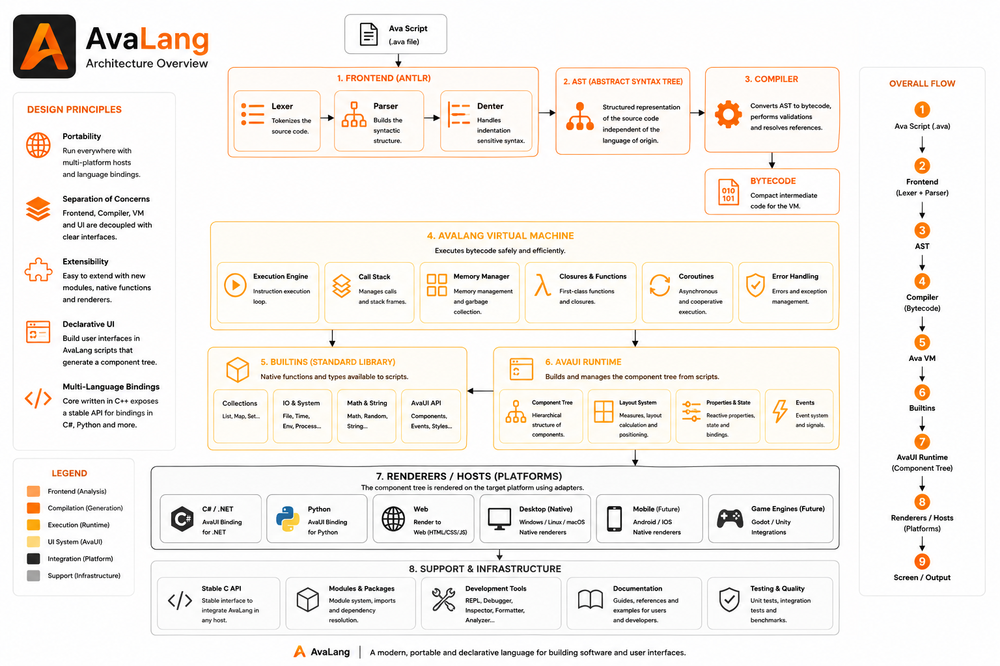

# El ecosistema AvaLang

Este repositorio reúne tres proyectos que trabajan juntos para llevar
una idea desde el primer boceto hasta un sitio real, publicado y
funcionando en un navegador — todo dentro del mismo ecosistema, sin
tener que salir a aprender herramientas sueltas para cada etapa.

## Los 3 proyectos

| | Proyecto | En pocas palabras |
|---|---|---|
| 🧠 | **[AvaLang](AVALANG.md)** | El lenguaje y el motor que hace correr todo lo demás. |
| 🎨 | **[Ava Studio](studio/README.md)** | El editor de escritorio donde se diseñan y escriben las apps. |
| 🌐 | **[AvaHost](avahost/README.md)** | El servidor que convierte esas apps en un sitio web real. |

Cada uno tiene su propio README con más detalle — haz click en el
nombre para entrar.

## Cómo encajan entre sí

- **AvaLang** es la base: define cómo se escribe el código y cómo se
  ejecuta. Los otros dos proyectos existen alrededor de él.
- **Ava Studio** es donde normalmente empieza el trabajo: ahí se
  diseñan las pantallas y se escribe la lógica detrás de ellas.
- **AvaHost** es donde ese trabajo termina viéndose como un sitio
  web de verdad, disponible para cualquiera que abra el navegador.

No hace falta usar los tres a la vez — cada uno funciona por su
cuenta — pero están pensados para complementarse.
