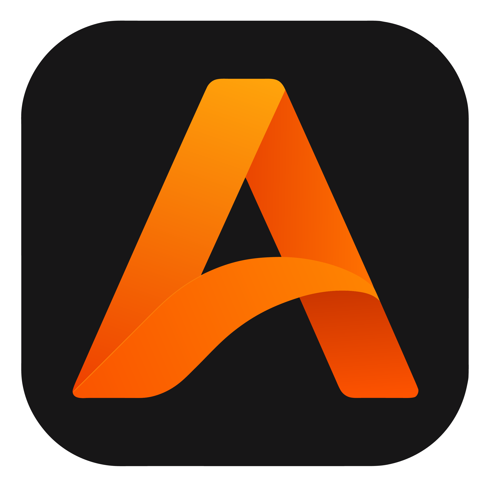

# Ava Studio

Ava Studio es el editor de escritorio donde se diseña y se escribe
todo lo que después AvaHost pone en un navegador.

Es el punto de partida del ecosistema: un lugar donde puedes armar
tus pantallas arrastrando y acomodando elementos visualmente, y a la
vez tener a mano un editor de código con resaltado propio para
AvaLang, pensado para que ambos mundos — el visual y el escrito — se
sientan como una sola herramienta, no como dos programas distintos
pegados con cinta adhesiva.

## ¿Qué resuelve?

Diseñar una pantalla y programar su comportamiento suelen ser dos
tareas separadas, muchas veces en dos programas distintos. Ava
Studio las junta:

- **Lienzo de diseño**, donde armas la pantalla acomodando
  componentes (botones, textos, imágenes, contenedores) y ves al
  instante cómo va quedando.
- **Editor de código**, para la lógica detrás de cada pantalla —
  qué pasa cuando alguien hace clic en un botón, qué datos se
  guardan, cómo se comunican las distintas partes de la app.
- **Catálogo de componentes**, con lo disponible para usar en el
  diseño, y una vista rápida de qué hace cada palabra clave del
  lenguaje mientras escribes.

## Pensado para acompañar todo el proceso

No es solo para el primer boceto: la idea es que se use durante todo
el desarrollo, desde la primera pantalla hasta el ajuste fino antes
de publicar, con el mismo proyecto abierto de principio a fin.

## Para quién es

Para quien prefiere ver lo que está construyendo mientras lo
construye, en vez de imaginarse el resultado leyendo únicamente
código.

---

⬅️ [Volver al menú principal](../README.md)
